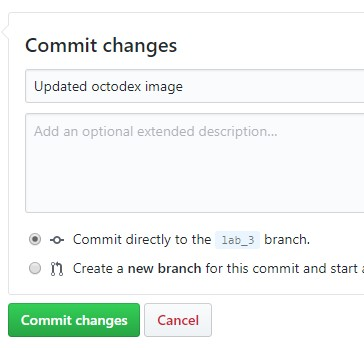
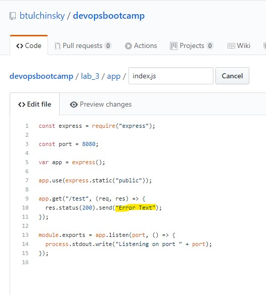
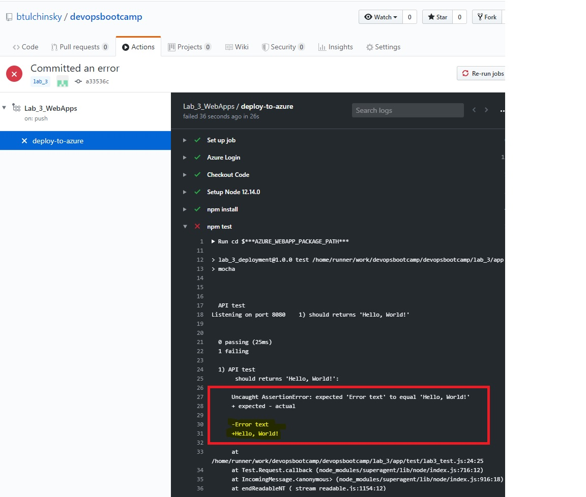

# Lab 3 - GitHub Actions

- [Create Google App Engine Instance](#Create-Google-App-Engine-Instance)
- [Enable App Engine Admin API](#Enable-App-Admin-API)
- [Configure GitHub App Trigger](#Configure-GitHub-App-Trigger)
- [Run Cloud Build](#Run-Cloud-Build)
- [Continuous Deployment of Changes](#Continuous-Deployment-of-Changes)
- [Unit Testing](#Unit-Testing)

---

## Overview

The third lab will deploy a NodeJS Web Application using Google Cloud Build.

> Note that unlike in previous labs, we will not destroy the application. This is due to a limitation in App Engine. The application can be disabled to stop traffic and stop costs incurred by App Engine. However, you can delete a service, except for the `default` service.See [here](https://cloud.google.com/appengine/docs/standard/nodejs/an-overview-of-app-engine) for more information on App Engine.

## Create Google App Engine Application

Create the Google App Engine Application that the pipeline will deploy to.

1. Navigate to `App Engine` form the top left menu, it will be under the `Compute` sub-heading. You will notice that there is currently no application and the option to create one is available.

> Note that you can use the UI to create the application. However we will use the `gcloud` command to show an alternative for automation.

2. Open Cloud Shell

3. Create the Google App Engine Application

```bash
gcloud app create --region=us-central
```

4. Refresh the page. You will see that your App Engine application has been created.

> 

That's it for the application creation! The application has a default service that we will deploy to and host our site.

## Enable App Engine Admin API

Since we will be using Cloud Build to deploy our application, we need to enable the `App Engine Admin API`. This will allow other services, such as Cloud Build, to administer on App Engine.

To enable the `App Engine Admin API`, run the following in Cloud Shell

```bash
gcloud services enable appengine.googleapis.com
```

## Configure GitHub App Trigger

We will now configure a Cloud Build trigger that will run the terraform commands to deploy the networking and compute resources in this project.

1. Open the **Triggers** page in the [Google Cloud Console](https://console.cloud.google.com/) and click **Create Trigger**

2. Similar to Lab 1 and Lab 2, enter a name (E.g., `lab3-trigger`) and description (E.g., `trigger for lab 3`) for your trigger.

3. Under Event, select Push to a new branch.

4. Under Source, select the repository that was connected earlier (E.g., githubuser/MyDevOpsBootCamp (GitHub App)). Enter `.*` for branch to trigger build on all branches.

5. Expand the 'Show Included and Ignored File Filters' section and enter `lab_3/**` under 'Included files filter (glob)' to indicate that only changes under the `lab_3/` folder should trigger a build. Enter `lab_3/destroy.txt` under 'Ignored files filter (glob)' to indicate that the file should not trigger a build.

6. Enter `lab_3/cloudbuild-lab3.yaml` under 'Cloud Build configuration file (YAML or JSON)'. This configuration file defines the build steps that will be performed when a build is triggered.

7. Click Create to finish creating the trigger on Cloud Build.

---

## Run Cloud Build

The workflow we just created is triggered by changes made to the files in the `lab_2/` directory. Let's make a change here to kick off the workflow. The `readme.txt` can be modified by simply adding a new line or some text. The act of committing this change to the `master` branch will instruct GitHub Actions to kick off our workflow.

1. Navigate to **Code**, and browse to the `lab_2/readme.txt` file. Click the pencil icon to edit the file, and add a new line. Provide a commit message and commit your change.

2. Navigate to **Cloud Build -> History** and you should see the build executing with the lab2-trigger name.

---

## Continuous Deployment of Changes

We will make some changes to the code and watch the pipeline automatically deploy those changes to the application.

1. Navigate to **Code**, open the `lab_3/app/public` directory and open the `index.html` file.

2. Find the Octodex image element (`img` tag) identified with the `id` attribute `octodex`.

> 

3. Go to [https://octodex.github.com/](https://octodex.github.com/) and copy the address of an Octodex that you like.

4. Update the `alt` and `src` attribute of the octodex `img` tag with description and copied address, respectively.

> 

5. Enter a commit message and click `Commit changes`.

> 

6. Navigate to **Actions** and observe the workflow.

> 

7. When the workflow finishes executing, open your browser and refresh or go to the `<Azure Web App name>.azurewebsites.net` website to observe the change in the application.

> 

---

## Unit Testing

We have deployed our application successfully due to the defined unit tests passing successfully. We will now intentionally introduce an error into the application.

1. Navigate to **Code**, open the `lab_3/app/` directory and open the `index.js` file.

> 

2. Change the `Hello, World!` text in the service `/path` response. It can be any misspelling or a completely different text, as long as it is different.

> 

> 

3. Enter a commit message and click `Commit changes`.

> 

4. Navigate to **Actions** to observe the Workflow. Which will fail.

> 

> 

5. Click on the Workflow to take a look at the more granular tasks the Workflow is running and expand the `npm test` task.

> 

6. Notice that the `API test` unit test failed and the `Deploy to Azure WebApp` was skipped. This is the default behaviour when an error occurs and the workflow is in a failed state.

> 

7. Notice that the `test pass message` was skipped, but the `test fail message` task did execute. This is because the `test fail message` has an `if` conditional execution on Workflow failure.

```yaml
- name: test fail message
  if: failure()
  run: |
    echo "npm tests failed! please check your code"
```

This demonstrates some of the flexibility of GitHub Action Workflows. Go to [https://help.github.com/en/actions/reference/workflow-syntax-for-github-actions](https://help.github.com/en/actions/reference/workflow-syntax-for-github-actions) for more information on other constructs and Workflow syntax.

8. Fix the Workflow by correcting the `lab_3/app/index.js` file with the proper text and commit the change.

---

## Disable the Application

To mimimize billing usage in your project, we can disable the application to reduce costs incurred by the application. Since the application can only be deleted along with the project, disabling it is the best way, unless of course, you would like to delete the project.

1. From the Google Cloud Console menu, select `App Engine` under `Compute`

## End of Lab 3

Links to more learning:

- **Azure App Service**: [https://docs.microsoft.com/en-us/azure/app-service/overview](https://docs.microsoft.com/en-us/azure/app-service/overview)
- **Node.js in Azure**: [https://docs.microsoft.com/en-us/azure/app-service/app-service-web-get-started-nodejs](https://docs.microsoft.com/en-us/azure/app-service/app-service-web-get-started-nodejs)
- **Unit Testing**: [https://en.wikipedia.org/wiki/Unit_testing](https://en.wikipedia.org/wiki/Unit_testing)


