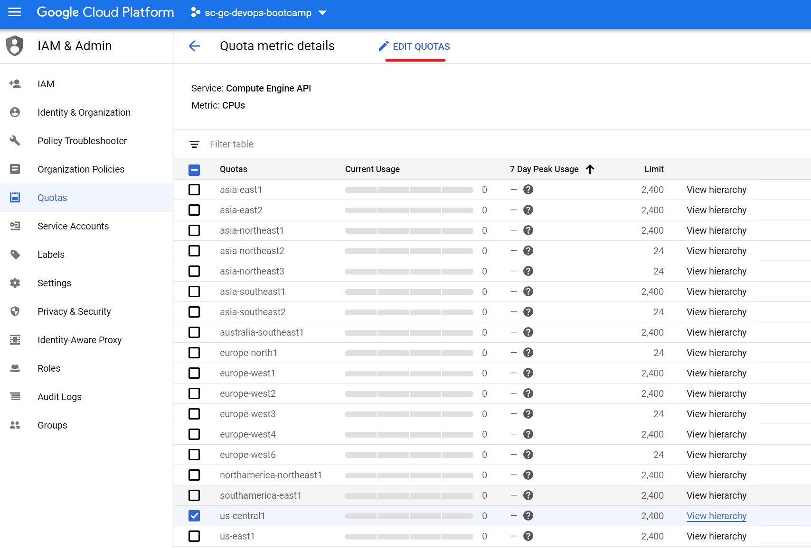
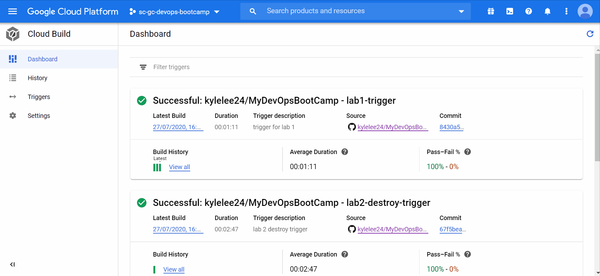
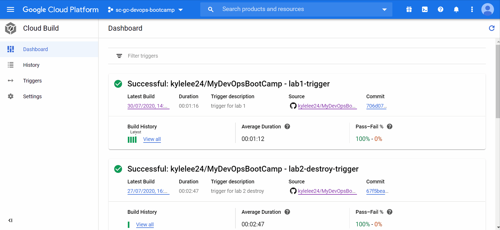

# Lab 4 - Deploy 75 Servers

- [Overview](#Overview)
- [Configure GitHub App Triggers](#Configure-GitHub-App-Triggers)
- [Create Terraform Deployment](#Create-Terraform-Deployment)
- [Clean Up Resources](#Clean-Up-Resources)

---

## Overview

The fourth lab is a demo of how we can quickly deploy 75 servers to Google Cloud.

> Note: Executing this lab will result in **75** n1-standard-1 vm's being deployed in your environment. If you have not requested a vCPU quota increase this may not complete successfully.

> 

---

## Configure GitHub App Triggers

We will now configure a Cloud Build trigger that will run the terraform commands to deploy the networking and compute resources in this project.

1. Open the **Triggers** page in the [Google Cloud Console](https://console.cloud.google.com/) and click **Create Trigger**

2. Similar to Lab 1, enter a name (E.g., `lab4-trigger`) and description (E.g., `trigger for lab 4`) for your trigger.

3. Under Event, select Push to a new branch.

4. Under Source, select the repository that was connected earlier (E.g., githubuser/MyDevOpsBootCamp (GitHub App)). Enter `.*` for branch to trigger build on all branches.

5. Expand the 'Show Included and Ignored File Filters' section and enter `lab_4/**` under 'Included files filter (glob)' to indicate that only changes under the `lab_4/` folder should trigger a build. Enter `lab_4/destroy.txt` under 'Ignored files filter (glob)' to indicate that the file should not trigger a build.

6. Enter `lab_4/cloudbuild-lab4.yaml` under 'Cloud Build configuration file (YAML or JSON)'. This configuration file defines the build steps that will be performed when a build is triggered.

7. Click Create to finish creating the trigger on Cloud Build.

> 

---

## Create Terraform Deployment

Trigger a terraform deployment to create 75 vm's via GitHub and Cloud Build

1. Navigate to **Code**, and browse to the `lab_4/readme.txt` file. Click the pencil icon to edit the file, and add a new line. Provide a commit message and commit your change.

---

## Clean Up Resources

To mimimize billing usage in your subscription we can remove all of the resources we deployed with Cloud Build by executing a Terraform destroy.

1. Create a new trigger on Cloud Build called `lab4-destroy-trigger`.

2. Use similar settings to the trigger created previously, except set the Included files filter to `lab_4/destroy.txt`, leave the Ignored files filter blank. For the Build Configuration, set the Cloud Build configuration file to `lab_4/cloudbuild-destroy-lab4.yaml`. Click create to finish creating the trigger.

> 

3. Go to the triggers page and select Run trigger to manually execute the build, which will destroy all the resources created.

> 

4. Once the build is completed we can open the [Google Cloud Console](https://console.cloud.google.com/) and confirm the resources we created earlier are now deleted.

---

## End of Lab 4

